# LP-ETL pipeliny slovenského národního katalogu otevřených dat - vývojový repozitář
Národní katalog otevřených dat je realizován jako sada 11 pipeline v [LinkedPipes ETL](https://etl.linkedpipes.com), které jsou v této sekci popsány.
Porozumění pipelinám vyžaduje znalost [RDF](https://www.w3.org/TR/rdf11-primer/) a [SPARQL](https://www.w3.org/TR/sparql11-overview/).
[Dokumentace jednotlivých komponent](https://etl.linkedpipes.com/components/) v pipeline je součástí [dokumentace](https://etl.linkedpipes.com/documentation/) nástroje LinkedPipes ETL.

Pro nasazení do testovacího a prodkučního prostředí je potřeba jejich export nahrát do [repozitáře pro import](https://github.com/datova-kancelaria/nkod-pipeline).

## Přípravné pipeline

Přípravné pipeline se spouští při inicializaci instance NKOD a pak v případě aktualizace externích číselníků.
Mezi přípravné pipeline se řadí i ty zpracovávající aktuální obsah data.gov.sk, jelikož se počítá s jeho eventuálním vypnutím, a tedy tyto pipeliny už dále nebudou spouštěny.

### 00 Cache
[00 - Cache](pipeliny/00%20-%20Cache.jsonld) - stáhne evropské číselníky pro [typy souborů](https://op.europa.eu/en/web/eu-vocabularies/dataset/-/resource?uri=http://publications.europa.eu/resource/dataset/file-type) a [frekvence](https://op.europa.eu/en/web/eu-vocabularies/dataset/-/resource?uri=http://publications.europa.eu/resource/dataset/frequency).
Ostatní pipeline pak používají tuto cache.
Jedná se o omezení závislostí na externích datových zdrojích v následném každodenním běhu NKOD.
Pokud se zdrojové číselníky změní, je vhodné cache přegenerovat.
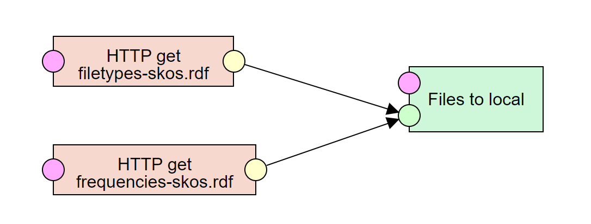

### 01 - Harvestace data.gov.sk
[01 - Harvestace data.gov.sk](pipeliny/01%20-%20Harvestace%20data.gov.sk%20-%20CKAN%20API.jsonld) stáhne aktuální obsah starého katalogu data.gov.sk pomocí jeho [CKAN API](https://docs.ckan.org/en/2.9/api/).
Výsledek je sada JSON souborů, které se uloží na disk pro následné zpracování.
Součástí běhu je i generování reportu chyb, který obsahuje přehled záznamů, které se nepovedlo získat.
To se děje zejména z důvodu timeoutů na straně CKAN API.
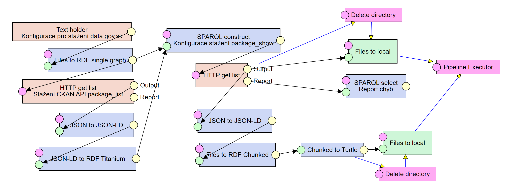

### 02 - Transformace data.gov.sk
[02 Transformace data.gov.sk](pipeliny/02%20-%20Transformace%20data.gov.sk%20-%20CKAN.jsonld) převede záznamy z data.gov.sk stažené předchozí pipeline do výsledné podoby dle DCAT-AP-SK.
Převod zahrnuje mapování IRI poskytovatelů, mapování územního pokrytí z polygonové reprezentace na IRI, sdružování a rozdělování datových sad do sérií a mapování hodnot ze CKAN API na hodnoty dle DCAT-AP-SK a evropských číselníků.
Tato pipeline vyžaduje jako vstup CSV podobu mapovacích tabulek, které jsou připravovány Datovou kanceláří.
Výsledkem je RDF dump ve formátu [RDF TriG](https://www.w3.org/TR/trig/).
Vypnuté komponenty představují různé statistiky, které mohou být použity pro přehled o použitých hodnotách různých položek v záznamech datových sad.
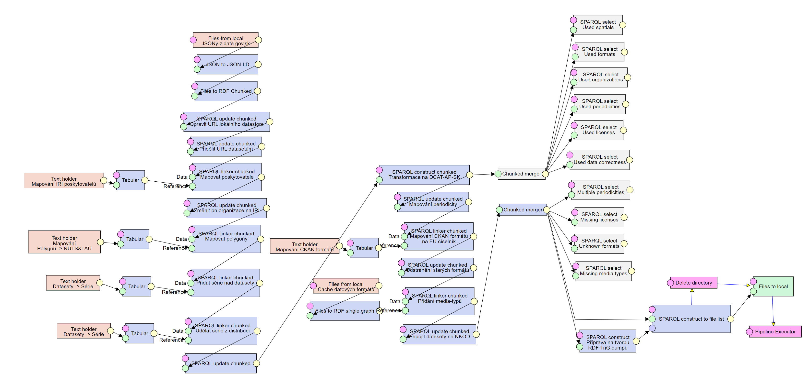

## Pipeline pro pravidelný běh NKOD

Tyto pipeline běží v pravidelných intervalech a zajišťují vytvoření aktuálního obsahu NKOD.
Platí, že pipeline na svém konci vždy pouští jednu či více navazujících pipeline.

### 03 - Harvestace LKOD a registrací
[03 - Harvestace LKOD a registrací](pipeliny/03%20-%20Harvestace%20LKOD%20a%20registrac%C3%AD.jsonld) je hlavní pipeline zajišťující zpracování záznamů z registračních formulářů a harvestaci lokálních katalogů otevřených dat (LKODů), aktuálně ve 3 provedeních dle [DCAT-AP-SK 2.0](https://datova-kancelaria.github.io/dcat-ap-sk-2.0/), tj. CKAN API, DCAT-AP SPARQL Endpoint a DCAT-AP Dokumenty.
Po dokončení harvestace přidává metadata pro samotný NKOD a generuje RDF TriG dump.
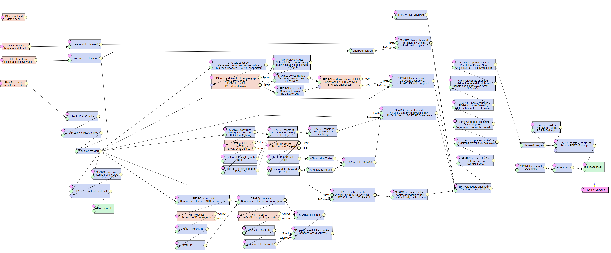
V levé části pipeline se přistupuje k registračním záznamům datových sad, lokálních katalogů a k registracím poskytovatelů.
Tyto vstupy existují v podobě adresářů se záznamy na serveru.
Do těchto adresářů se aktuálně dostávají z [GitHub repozitáře](https://github.com/datova-kancelaria/nkod-registrace).
Toto bude v dalším vývoji nahrazeno plněním z ostatních částí portálu otevřených dat.

V prostřední části pipeline je patrných 5 horizontálních částí.
1. V první části tečou data z původního data.gov.sk, která byla připravena v předchozích pipeline.
2. V druhé části tečou jednotlivé záznamy datových sad pořízené v budoucnu formulářem na portálu otevřených dat.
3. Třetí část zpracovává lokální katalogy používající [rozhraní DCAT-AP SPARQL Endpoint](https://datova-kancelaria.github.io/dcat-ap-sk-2.0/#rozhranie-sparql-endpoint).
4. Čtvrtá část zpracovává lokální katalogy používající [rozhraní DCAT-AP Dokumenty](https://datova-kancelaria.github.io/dcat-ap-sk-2.0/#rozhranie-dcat-ap-dokumenty).
5. Pátá část zpracovává lokální katalogy používající [rozhraní CKAN API](https://datova-kancelaria.github.io/dcat-ap-sk-2.0/#rozhranie-ckan-api)

Záznamy o datových sadách z různých zdrojů se následně spojí, pročistí, jsou přidána metadata NKOD, zejména datum harvestace, a nakonec je vytvořen RDF TriG dump obsahující aktuální podobu NKOD.

### 03.1 - Nahrát NKOD do GraphDB
[03.1 - Nahrát NKOD do GraphDB](pipeliny/03.1%20-%20Nahr%C3%A1t%20NKOD%20do%20GraphDB.jsonld) nahrává obsah NKOD vygenerovaný v minulé pipeline do GraphDB. Nejprve je aktuální obsah GraphDB smazán, následně je nahrazen aktuální podobou NKOD.
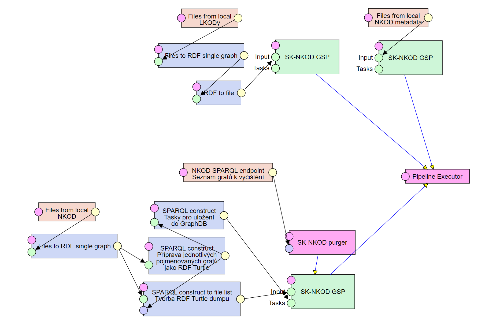

### 03.2 - Spustit pipeliny pro kvalitu
[03.2 - Spustit pipeliny pro kvalitu](pipeliny/03.2%20-%20Spustit%20pipeliny%20pro%20kvalitu.jsonld) spouští následující pipeliny, které generují na základě aktuálního obsahu NKOD indikátory (meta)datové kvality.
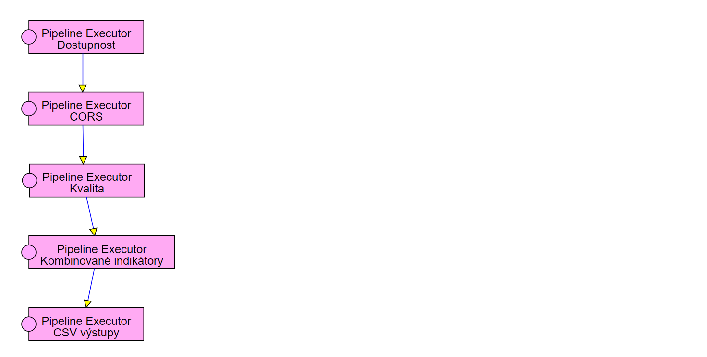

### 04 - Statistika dostupnosti distribucí, schémat, podmínek užití a dokumentace - HEAD
[04 - Statistika dostupnosti distribucí, schémat, podmínek užití a dokumentace - HEAD](pipeliny/04%20-%20Statistika%20dostupnosti%20distribuc%C3%AD%2C%20sch%C3%A9mat%2C%20podm%C3%ADnek%20u%C5%BEit%C3%AD%20a%20dokumentace%20-%20HEAD.jsonld) - Zkontroluje dostupnost všech v NKOD zaregistrovaných URL pomocí `HTTP HEAD` požadavku s timeoutem 3 vteřiny.
Jednotlivé větve představují jednotlivé druhy URL registrované v NKOD, jako je například URL souboru ke stažení, URL dokumentace datové sady, atd.
Následně je informace o (ne)dostupnosti reprezentována pomocí [Data Quality Vocabulary](https://www.w3.org/TR/vocab-dqv/) a nahrána do SPARQL endpointu NKOD.
Agregované indikátory dostupnosti jsou uchovávány jako časová řada v souborech.
Neagregované indikátory jsou při každém běhu přepsány.
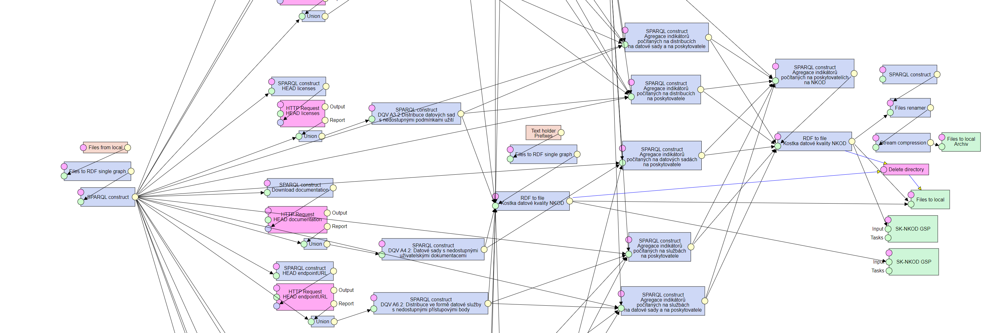

### 05 - Statistika dostupnosti distribucí, schémat, podmínek užití a dokumentace - CORS
[05 - Statistika dostupnosti distribucí, schémat, podmínek užití a dokumentace - CORS](pipeliny/05%20-%20Statistika%20dostupnosti%20distribuc%C3%AD%2C%20sch%C3%A9mat%2C%20podm%C3%ADnek%20u%C5%BEit%C3%AD%20a%20dokumentace%20-%20CORS.jsonld) - Zkontroluje dostupnost techniky CORS na vybraných v NKOD zaregistrovaných URL pomocí `HTTP OPTIONS` požadavku s timeoutem 3 vteřiny.
Jednotlivé větve představují jednotlivé druhy URL registrované v NKOD, jako je například URL souboru ke stažení, URL dokumentace datové sady, atd.
Následně je informace o (ne)dostupnosti CORS reprezentována pomocí [Data Quality Vocabulary](https://www.w3.org/TR/vocab-dqv/) a nahrána do SPARQL endpointu NKOD.
Agregované indikátory dostupnosti jsou uchovávány jako časová řada v souborech.
Neagregované indikátory jsou při každém běhu přepsány.
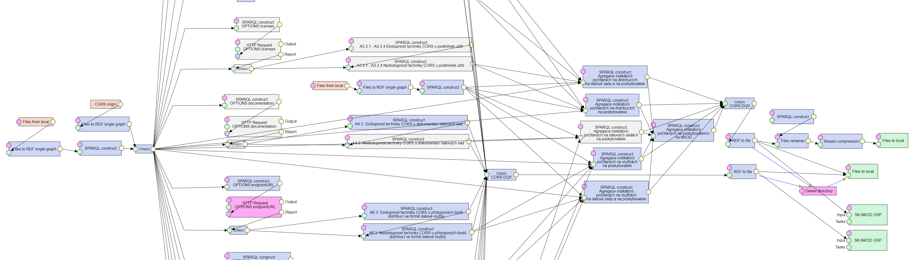

### 06 - Kvalita metadatových záznamů v NKOD DQV
[06 - Kvalita metadatových záznamů v NKOD DQV](pipeliny/06%20-%20Kvalita%20metadatov%C3%BDch%20z%C3%A1znam%C5%AF%20v%20NKOD%20DQV.jsonld) - Počítá jednotlivé indikátory kvality metadatových záznamů v NKOD s ohledem na úplnost záznamu vůči [DCAT-AP-SK](https://datova-kancelaria.github.io/dcat-ap-sk-2.0/) a základní statistiky.
Agregované indikátory dostupnosti jsou uchovávány jako časová řada v souborech.
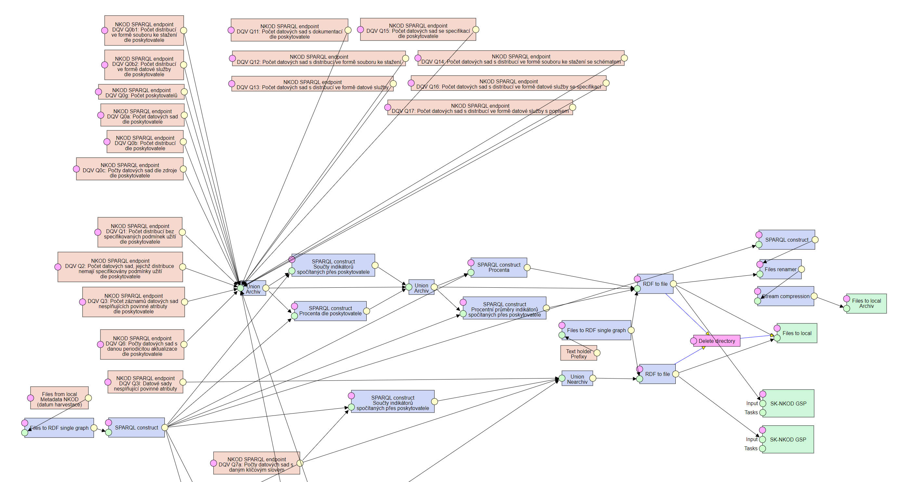

### 07 - Kombinované indikátory kvality
[07 - Kombinované indikátory kvality](pipeliny/07%20-%20Kombinovan%C3%A9%20indik%C3%A1tory%20kvality.jsonld) - Počítá indikátory kvality kombinované z předchozích výsledků.
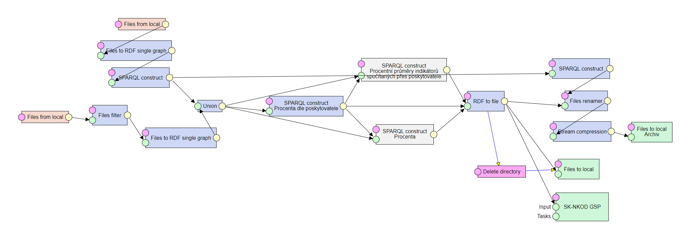

### 08 - Generování reportů v CSV
[08 - Generování reportů v CSV](pipeliny/08%20-%20Generov%C3%A1n%C3%AD%20report%C5%AF%20v%20CSV.jsonld) - Z naměřených indikátorů generuje CSV soubory s přehledy, které jsou dostupné ke stažení přes portál otevřených dat.
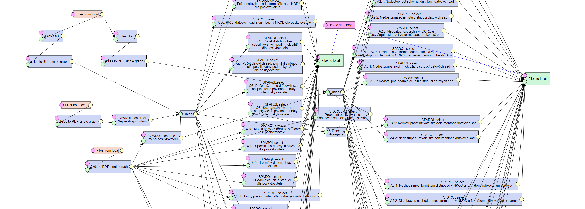

## Servisní pipeline

Servisní pipeliny jsou určeny pro administrátorské zásahy, testování a ladění a v běžném produkčním režimu nejsou spouštěny.

### 00 - Nahrát aktuální stav do GraphDB
[00 - Nahrát aktuální stav do GraphDB](pipeliny/servisn%C3%AD/00%20-%20Nahr%C3%A1t%20aktu%C3%A1ln%C3%AD%20stav%20do%20GraphDB.jsonld) - Smaže aktuální obsah GraphDB a nahraje znovu její obsah z RDF dumpů.
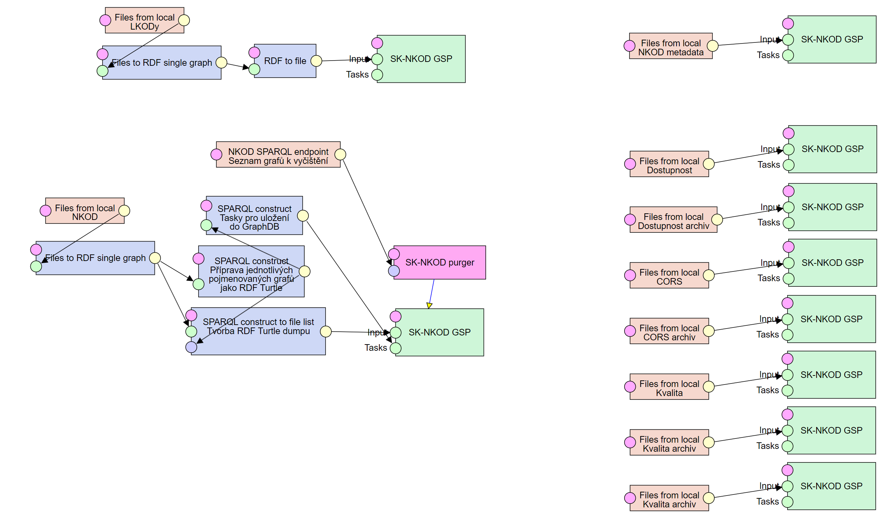

### CouchDB hack
[CouchDB hack](pipeliny/servisn%C3%AD/CouchDB%20hack.jsonld) slouží k nahrání číselníků do CouchDB pro jejich správné zobrazení v DCAT-AP Vieweru - uživatelském rozhraní českého NKOD. Zde je použit pouze pro testovací účely a není součástí produkčního slovenského NKOD.

### Smazat GraphDB
[Smazat GraphDB](pipeliny/servisn%C3%AD/Smazat%20GraphDB.jsonld) slouží ke smazání obsahu GraphDB.

### CSW catalog test
[CSW catalog test](pipeliny/servisn%C3%AD/CSW%20catalog%20test.jsonld) slouží jako demonstrace možnosti harvestace katalogu typu služba CSW - geodata. Tento typ harvestace nakonec nebude nasazen do produkce, CSW katalogy vystaví rozhraní dle DCAT-AP-SK.

### DCAT-AP dump to LP-DAV (NKOD)
[DCAT-AP dump to LP-DAV (NKOD)](pipeliny/servisn%C3%AD/DCAT-AP%20dump%20to%20LP-DAV%20(NKOD).jsonld) nahrává aktuální obsah NKOD z RDF dumpu do CouchDB a Apache Solr pro zobrazení v DCAT-AP Vieweru - uživatelském rozhraní českého NKOD. Zde slouží pouze pro testování - nebude součástí produkčního řešení.

